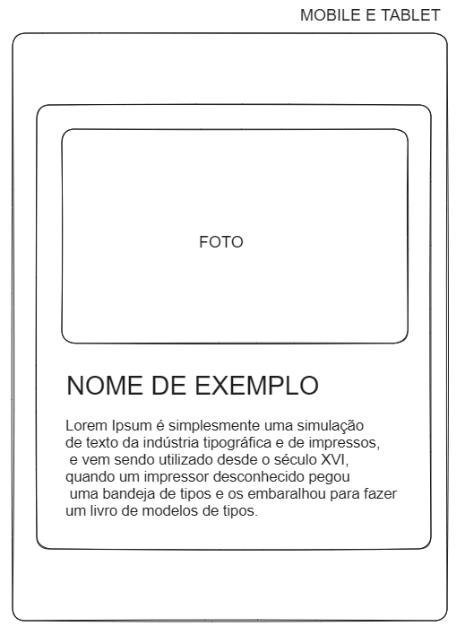
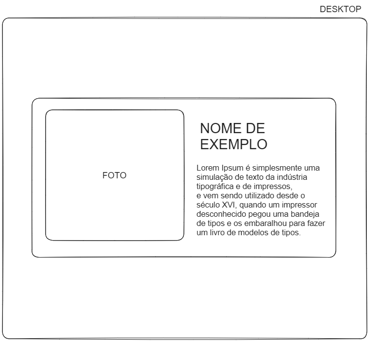

# ATIVIDADE PRÁTICA

Ela consite em criar um card com algumas informações e que se adapte tanto para mobile quanto para desktop.

### Deve ser utilizado:

- O flexbox para centralizar o card no centro da tela e organizar a disposição dos elementos dentro do card.
- Os media queries para adaptar a visualização para telas maiores.
- Pelo menos 2 animações.

### Layouts:

#### - Mobile/Tablet:

#### - Desktop:

---

#### \*\*Não será cobrado a entrega da atividade, desafie-se!!
